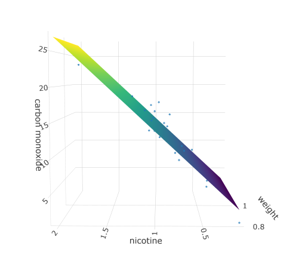

# Interactive 3D plot showing regression plane from multiple linear regression

A multiple linear regression model is created using cigarette data as an example.
Interactive 3D plot is created using plotly library and saved as a html widget.

No analysis is done on the fitted model.

